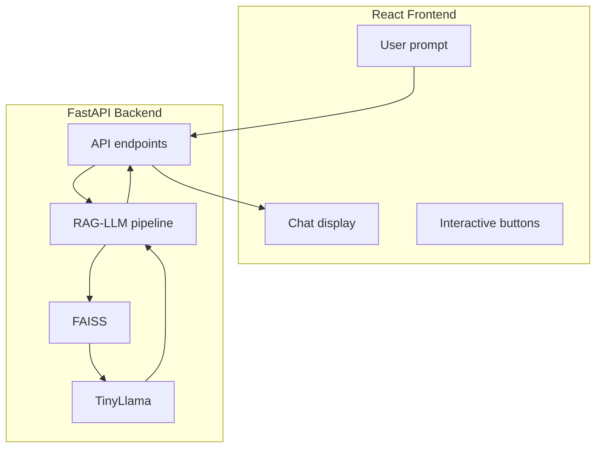

# Frontend UI for Zero-Shot Retrieval Augmented Generation (RAG)-LLM

This project was created by Elizabeth Marcellina to supplement the backend chatbot [backend chatbot] (https://github.com/EMarc2023/zero-shot-rag-llm). 

This project was created with TypeScript and [Create React App](https://github.com/facebook/create-react-app).

## Author Contact

The author (Elizabeth Marcellina) can be contacted on LinkedIn: https://www.linkedin.com/in/elizabeth-marcellina/.

## Build Status

[](https://github.com/EMarc2023/zero-shot-rag-llm-frontend/actions/workflows/main.yml)

## Key Features

This UI allows the users to interact with the RAG-LLM chatbot. There are 4 buttons in the UI `Send to chatbot`, `Clear forms`, `Clear chat`, and `Download chat`. Note that the button `Send to chatbot` is disabled when the `RAG keyword(s):` and `User prompt:` fields are empty, or if the chatbot is in the midst of generating a response (which is indicated by a spinner and a `Loading...` indicator).  

## Architectural Diagram



## Backend API (FastAPI) Integration

This frontend communicates with the backend API (for FastAPI, the default is `http://localhost:8000`), as configured via environment variables, for the user to send queries to the chatbot and receive responses from the chatbot. The primary endpoint used is `/answer_with_user_prompts/`, where data is exchanged in the JSON format.

## Environmental Variables

To configure the backend API URL, create the environment variables `.env.development` and `env.production` in the frontend directory with the following content:

```
REACT_APP_BACKEND_API_URL=backend_url
```

The `backend_url`, for FastAPI, is by default `http://localhost:8000`.

## Access & Execution

### Prerequisites

Before using this codebase, install `Node.js` and the `npm` package manager:

* Node.js (this project was created using Node.js version 22.14)
* npm or yarn (this project was created using npm 11.2.0)

### How to run the code

1.  Clone the repository by running: `git clone (https://github.com/EMarc2023/zero-shot-rag-llm-frontend)` into your prefered directory (in this example: `frontend` directory).
2.  Navigate to the `frontend` directory using command line: `cd frontend`.
3.  Install dependencies: `npm install` or `yarn install`.

### Available Scripts

Once the dependencies are installed, in the project directory, you can run:

#### `npm start`

This command runs the app in the development mode.\
Open [http://localhost:3000](http://localhost:3000) to view the UI in the browser.

#### `npm test`

This command runs the unit tests (`src/App.test.tsx` and `src/ChatInterface.test.tsx`) for the app. 

The documentation for running unit tests for React apps can be found in [running tests](https://facebook.github.io/create-react-app/docs/running-tests).

#### `npm run build`

This command builds the app for production to the `build` folder.\

It bundles React in production mode and optimises the build for the best performance. 

The documentation for deploying React apps can be found in [deployment](https://facebook.github.io/create-react-app/docs/deployment).

## License

This project is licensed under the Apache License 2.0 - see the [LICENSE](https://www.apache.org/licenses/LICENSE-2.0) file for details.

